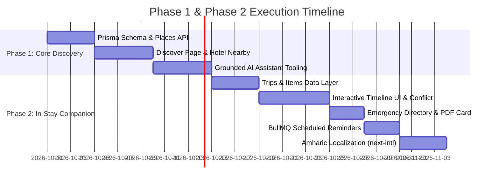

# YayeTech — Phase 1 & Phase 2 Web & Backend Implementation Plan

> **Document Version:** 1.0.0  
> **Status:** Approved Architecture Draft  
> **Target Applications:** `apps/web` (Next.js 15), `apps/api` (NestJS 10), `packages/shared-types`  
> **Reference Document:** `YayeTech_Roadmap_and_Future_Work.md`  

---

## 1. Executive Summary & Vision

This implementation plan details the architectural and engineering steps required to evolve the YayeTech platform from a standalone **Hotel Booking Engine** into an **In-Stay Ethiopia Travel Companion**.

### Core Value Proposition
While traditional travel platforms stop providing value once a hotel room is booked, YayeTech stays with the traveler throughout their stay:
* **Discover**: Curated, verified local heritage, culinary landmarks, and authentic coffee spots within walking or short driving distance of the traveler's hotel.
* **Plan & Companion ("My Trip")**: Interactive day-by-day itinerary canvas combining hotel bookings, discovered places, and custom traveler activities with automated schedule conflict detection.
* **Safe Travel**: Verified emergency directory with timestamps and official sources, accessible offline and integrated into the hotel context.
* **Grounded AI Assistant**: Context-aware assistant that answers questions and drafts itinerary activities strictly using verified database records.
* **Bilingual Experience**: Full English and Amharic (አማርኛ) support for both international visitors and Ethiopian domestic travelers.

---

## 2. Rule Catalog & Architectural Guardrails

Every feature implemented across Phase 1 and Phase 2 must strictly satisfy the project rule catalog:

| Rule ID | Rule Statement | Implementation Strategy |
|---|---|---|
| **TRIP-001** | A trip and its items belong strictly to one user (`trip.userId = caller.id`). | Enforced in `TripService` and API guards. Cross-user access returns `403 Forbidden`. |
| **TRIP-002** | Trips are private by default. | No public indexing or open sharing without deliberate user opt-in. |
| **TRIP-003** | A `place` item must reference a published place; a `booking` item must reference caller's own booking. | Foreign key integrity check on item creation. |
| **TRIP-004** | Item dates must fall within `[trip.startDate, trip.endDate]`. | Date boundary validation in `CreateTripItemDto`. Times are evaluated in `Africa/Addis_Ababa`. |
| **TRIP-005** | Overlapping timed items on the same day generate a visible warning banner. | Interval overlap detection query executed at item save/edit time. |
| **TRIP-006** | Reminders are scheduled BullMQ jobs synchronized with item lifecycle. | Updates or deletions cleanly cancel and re-queue scheduled alerts without duplicates. |
| **TRIP-007** | No travel-time or "leave by" advice is displayed without an official routing engine. | System only shows linear/Haversine distance; never estimates arrival traffic times. |
| **TRIP-008** | AI-suggested items are marked `createdBy = 'ai'` and require explicit on-screen user confirmation. | Two-step confirmation flow: Assistant returns draft card; user must click "Add to Trip". |
| **TRIP-009** | Deleting a trip is a soft delete; deleting an itinerary item never cancels or alters the underlying hotel booking. | Cascading soft-deletion with decoupled relations. |
| **TRIP-010** | Emergency contacts must carry `lastVerifiedAt` and an official `sourceId`. | Database constraint: contacts cannot be published with null verification timestamps. |
| **TRIP-011** | The AI assistant reads emergency contacts strictly from `EmergencyContact`, never from LLM weights. | Grounded RAG with strict prompt guardrails. |
| **ROAD-001** | Every listed place must have an attributed owner/source and license. | `Source` entity relation required for all places. |
| **ROAD-002** | New pillars maintain distinct models; avoid generic monolithic "listings" tables. | Distinct `Place`, `TripItem`, and `EmergencyContact` tables. |

### 2.1 Sources & Licensing Governance (History, Places & POIs)

In strict adherence to rule `ROAD-001`, all historical data, cultural heritage sites, points of interest (POIs), and coordinates must originate from legitimate sources with explicit attribution and licensing compliance:

| Source | Used for | How | Status & Licensing Policy |
|---|---|---|---|
| **OpenStreetMap** | Coordinates + everyday POIs | Bulk extract (not live API calls) | Usable with attribution *"© OpenStreetMap contributors"*; share-alike (ODbL) can reach a derived database — **keep OSM rows identifiable** in database. |
| **UNESCO** | World Heritage facts & history | Curated entries in your own words + link | Terms must be checked before storing text; summarize facts independently, link to official UNESCO record. |
| **Ethiopian Heritage Authority** | Heritage verification | Research; request official data | No assumed reuse rights; requires official clearance/partnership for proprietary data. |
| **Ministry of Tourism** | National history / tourism guide | Reference; approach for official data | No assumed reuse rights; used for official reference and fact-checking. |
| **Visit Ethiopia** | Category ideas & taxonomy | Reference only | **Do not copy its directory.** Strictly used as taxonomy inspiration. |
| **YayeTech / Hotel Data** | Hotel-specific facts & amenities | Manager / Admin verified entry | Proprietary (Yours). Full reuse rights. |

#### Data Seeding & Frontend Attribution Rules:
1. In `apps/api/prisma/seed.ts`, every seeded `Place` row must be linked to its corresponding `Source` record (`sourceId`).
2. For all OSM-derived places, the frontend card tooltip and modal must display: `Data © OpenStreetMap contributors`.
3. Historical narratives for UNESCO sites and Ethiopian landmarks must be original summaries linking to official documentation, avoiding direct copy-pasting of protected texts.

---

## 3. Database Schema & Prisma Migrations (`apps/api/prisma/schema.prisma`)

Add the following models, relations, and enums to the Prisma schema:

```prisma
// ==========================================
// Phase 1: Sources & Places Discovery
// ==========================================

enum PlaceCategory {
  RESTAURANT
  COFFEE
  HERITAGE
  MUSEUM
  VIEWPOINT
  PARK
  CULTURE
  SHOPPING
  HOSPITAL
  PHARMACY
  EMERGENCY
}

model Source {
  id                String             @id @default(cuid())
  name              String
  url               String?
  license           String?            // e.g., "Official City Registry", "Creative Commons", "Direct Hotel Partnership"
  verifiedBy        String?
  createdAt         DateTime           @default(now())
  updatedAt         DateTime           @updatedAt
  places            Place[]
  emergencyContacts EmergencyContact[]

  @@map("sources")
}

model Place {
  id           String        @id @default(cuid())
  name         String
  nameAm       String?       // Amharic translation
  description  String?       @db.Text
  category     PlaceCategory
  latitude     Float
  longitude    Float
  address      String?
  cityId       String
  city         City          @relation(fields: [cityId], references: [id], onDelete: Cascade)
  sourceId     String
  source       Source        @relation(fields: [sourceId], references: [id])
  openingHours Json?         // { "mon": { "open": "08:00", "close": "20:00" }, ... }
  priceLevel   Int?          @default(1) // 1 to 4 ($ to $$$$)
  coverPhoto   String?
  photos       String[]
  phone        String?
  website      String?
  isPublished  Boolean       @default(false)
  verifiedAt   DateTime?
  createdAt    DateTime      @default(now())
  updatedAt    DateTime      @updatedAt
  tripItems    TripItem[]

  @@index([cityId, category])
  @@index([latitude, longitude])
  @@map("places")
}

// ==========================================
// Phase 2: Trips & Itinerary Planner
// ==========================================

enum TripItemType {
  PLACE
  BOOKING
  CUSTOM
}

enum TripItemStatus {
  PLANNED
  DONE
  SKIPPED
}

enum CreatedByOrigin {
  USER
  AI
}

model Trip {
  id         String     @id @default(cuid())
  userId     String
  user       User       @relation(fields: [userId], references: [id], onDelete: Cascade)
  title      String
  hotelId    String?
  hotel      Hotel?     @relation(fields: [hotelId], references: [id], onDelete: SetNull)
  bookingId  String?
  booking    Booking?   @relation(fields: [bookingId], references: [id], onDelete: SetNull)
  startDate  DateTime   @db.Date
  endDate    DateTime   @db.Date
  timezone   String     @default("Africa/Addis_Ababa")
  createdAt  DateTime   @default(now())
  updatedAt  DateTime   @updatedAt
  deletedAt  DateTime?
  items      TripItem[]

  @@index([userId, startDate])
  @@map("trips")
}

model TripItem {
  id          String          @id @default(cuid())
  tripId      String
  trip        Trip            @relation(fields: [tripId], references: [id], onDelete: Cascade)
  dayDate     DateTime        @db.Date
  startTime   String?         // "HH:mm" format (24-hour)
  durationMin Int?
  itemType    TripItemType
  placeId     String?
  place       Place?          @relation(fields: [placeId], references: [id], onDelete: SetNull)
  bookingId   String?
  booking     Booking?        @relation(fields: [bookingId], references: [id], onDelete: SetNull)
  title       String
  notes       String?         @db.Text
  costAmount  Decimal?        @db.Decimal(10, 2)
  currency    String?         @default("ETB")
  status      TripItemStatus  @default(PLANNED)
  position    Int             @default(0)
  createdBy   CreatedByOrigin @default(USER)
  createdAt   DateTime        @default(now())
  updatedAt   DateTime        @updatedAt

  @@index([tripId, dayDate, startTime])
  @@map("trip_items")
}

// ==========================================
// Phase 2: Emergency Directory
// ==========================================

enum EmergencyContactKind {
  POLICE
  AMBULANCE
  FIRE
  HOTEL
  EMBASSY
  CLINIC
  HOSPITAL
  OTHER
}

model EmergencyContact {
  id             String               @id @default(cuid())
  city           String?              // Null = National
  hotelId        String?              // Optional: hotel specific front desk/security
  hotel          Hotel?               @relation(fields: [hotelId], references: [id], onDelete: SetNull)
  kind           EmergencyContactKind
  name           String
  nameAm         String?
  phone          String
  alternatePhone String?
  address        String?
  sourceId       String
  source         Source               @relation(fields: [sourceId], references: [id])
  lastVerifiedAt DateTime             @default(now())
  isPublished    Boolean              @default(true)
  createdAt      DateTime             @default(now())
  updatedAt      DateTime             @updatedAt

  @@index([city, kind])
  @@map("emergency_contacts")
}
```

---

## 4. Backend Service Architecture (`apps/api`)

### 4.1 Module Structure
```
apps/api/src/modules/
├── places/
│   ├── application/places.service.ts
│   ├── presentation/places.controller.ts
│   └── dto/nearby-places.dto.ts
├── trip/
│   ├── application/trip.service.ts
│   ├── application/conflict-detector.service.ts
│   ├── presentation/trip.controller.ts
│   └── dto/create-trip.dto.ts, add-item.dto.ts
├── emergency/
│   ├── application/emergency.service.ts
│   └── presentation/emergency.controller.ts
└── assistant/
    ├── application/assistant.service.ts
    ├── application/tools/
    │   ├── search-hotels.tool.ts
    │   ├── nearby-places.tool.ts
    │   ├── my-trip.tool.ts
    │   └── emergency-info.tool.ts
    └── presentation/assistant.controller.ts
```

### 4.2 Proximity Calculation Algorithm (`PlacesService`)
To calculate walking and driving proximity from a hotel to nearby places:
$$\text{Distance} = 2R \cdot \arcsin\left(\sqrt{\sin^2\left(\frac{\Delta \text{lat}}{2}\right) + \cos(\text{lat}_1) \cos(\text{lat}_2) \sin^2\left(\frac{\Delta \text{lng}}{2}\right)}\right)$$
* In PostgreSQL, compute via the spherical distance formula or PostGIS `ST_DistanceSphere`.
* Return results sorted by ascending distance, labeled with category and verified source.

### 4.3 Schedule Overlap & Conflict Detector (`ConflictDetectorService`)
Rule `TRIP-005` specifies that timed activities on the same day must not conflict without notifying the user.
1. When a `TripItem` with `startTime` and `durationMin` is inserted or updated:
   * Let $S_{\text{new}} = \text{startTime}$ and $E_{\text{new}} = S_{\text{new}} + \text{durationMin}$.
2. Query existing items for `tripId` on `dayDate` where `startTime IS NOT NULL` and `id != currentItem.id`:
   $$\text{Overlap} \iff \max(S_{\text{new}}, S_{\text{existing}}) < \min(E_{\text{new}}, E_{\text{existing}})$$
3. If overlap is found, the API returns the item with a metadata warning flag:
   ```json
   {
     "item": { "id": "...", "title": "National Museum Visit" },
     "hasConflict": true,
     "conflictWith": {
       "id": "...",
       "title": "Lunch at Tomoca",
       "timeWindow": "12:30 - 14:00"
     }
   }
   ```

### 4.4 Automated Reminders Engine (`JobsModule`)
Using Redis and BullMQ (`apps/api/src/modules/jobs`):
1. **Hotel Check-in Reminder**: Scheduled for `booking.checkInDate - 24 hours` and `checkInDate - 2 hours`.
2. **Activity Reminder**: Scheduled for `item.dayDate + item.startTime - 30 minutes`.
3. If an item time is modified or deleted, the corresponding BullMQ jobId (`trip-item-${itemId}`) is removed and re-scheduled.

---

## 5. Web Frontend Architecture & Implementation (`apps/web`)

### 5.1 Route Tree
```
apps/web/src/app/
├── (main)/
│   ├── discover/
│   │   ├── page.tsx                    # Discovery Grid & Map
│   │   └── [placeId]/page.tsx          # Place Details with Source Attribution
│   ├── trips/
│   │   ├── page.tsx                    # Trip List & Active Stay Card
│   │   └── [tripId]/page.tsx           # Interactive Itinerary Timeline
│   └── emergency/
│       └── page.tsx                    # Verified Emergency Directory & Printable Card
```

### 5.2 Key User Interface Specifications

#### 1. Discovery Center (`/discover`)
* **Category Filter Bar**: Pills with icons for *All, Historical Heritage, Authentic Coffee, Local Dining, Museums, Viewpoints*.
* **Radius & Neighborhood Selector**: Choose Bole, Kazanchis, Piazza, or custom radius slider (1 km to 10 km).
* **Place Card Design**:
  * High-resolution imagery with fallback placeholder.
  * Distance badge (e.g., `450m from your hotel`).
  * Source Attribution Tooltip: *"Verified by Ethiopian Heritage Authority on 12/08/2026"*.
  * Action button: **"Add to Itinerary"** (opens trip selector modal).
* **Dual View**: Seamless switch between responsive CSS Grid and Leaflet/MapLibre map view.

#### 2. Hotel Detail Integration (`/booking/[hotelId]`)
* Embed a dedicated **"Neighborhood & Culture"** section directly beneath the hotel room catalog.
* Displays the 6 nearest places across Coffee, Heritage, and Dining.
* Travelers booking the hotel can preview walking attractions before finalizing reservations.

#### 3. "My Trip" Itinerary Planner (`/trips/[tripId]`)
* **Header Summary**:
  * Trip title, date range, linked hotel booking card with 1-click room key/booking reference.
  * Budget Tracker: Dynamic tally of planned expenses in both ETB and USD.
* **Horizontal Day Selector**:
  * Scrollable tabs: `Day 1 (Oct 12)`, `Day 2 (Oct 13)`, etc.
* **Timeline Canvas**:
  * Vertical timeline with time notches (`09:00`, `12:00`, `15:00`).
  * Draggable item cards colored by category (Stay = Gold, Heritage = Emerald, Dining = Amber, Custom = Slate).
  * Checkbox to mark items as `DONE` or `SKIPPED`.
* **Conflict Warning Banner**:
  * High-visibility alert when two items overlap, offering a 1-click **"Auto-adjust time"** or **"Keep both"** decision.

#### 4. Verified Emergency Directory (`/emergency`)
* Accessible globally from the website navbar and footer.
* **National Hotlines 1-Click Dial**:
  * Police: `991`
  * Medical Ambulance: `907`
  * Fire & Rescue: `939`
* **Geolocated Medical Assistance**:
  * Lists closest 24/7 hospitals and pharmacies relative to the user's active hotel.
* **Embassies & Consulates**: Searchable dropdown of foreign missions in Addis Ababa with direct emergency assistance numbers.
* **Safety Printout**: Generates a clean A4/PDF "Pocket Hotel Card" containing the hotel's name and address written in Amharic script for taxi drivers, alongside key emergency numbers.

#### 5. Grounded AI Travel Assistant Widget
* Luxury floating pill in bottom-right (`Ask LuxStay AI`).
* Chat interface with real-time streaming answers.
* When recommending places, the assistant renders **Interactive Place Cards** directly inside the chat window.
* When suggesting an itinerary addition:
  * Renders a **Draft Confirmation Card** (`AI-035`):
    > *"I have drafted a visit to the National Museum of Ethiopia at 10:00 AM on Day 2. Would you like to add this to your trip?"*
    > `[Confirm & Add to Trip]` `[Dismiss]`

#### 6. Multilingual Architecture — Amharic (አማርኛ)
* Integrate `next-intl` localization.
* Language toggle in top navigation: `EN | አማ`.
* Load Google Font **`Noto Sans Ethiopic`** in `apps/web/src/app/layout.tsx` for native Ethiopic rendering.
* Translation keys organized by namespace:
  * `common.json`, `discover.json`, `trips.json`, `emergency.json`.

---

## 6. Sprint Roadmap & Execution Order



### Sprint Breakdown

#### Sprint 1: Places & Heritage DB Core
1. Update `schema.prisma` with `Source` and `Place` models.
2. Run database migration and generate Prisma client.
3. Build `PlacesModule` in `apps/api` with proximity endpoints.
4. Seed verified Addis Ababa cultural data (Entoto, National Museum, Tomoca, Holy Trinity).

#### Sprint 2: Web Discovery & Hotel Integration
1. Build `/discover` page with category filtering and interactive map.
2. Embed "Nearby Landmarks & Cafes" carousel into `/booking/[hotelId]`.
3. Add source verification tooltips and licenses.

#### Sprint 3: Grounded AI Assistant (Text & Tools)
1. Implement OpenAI/Gemini tool-calling controller in `apps/api`.
2. Connect `searchHotels` and `getNearbyPlaces` functions with database queries.
3. Build floating responsive chat drawer on `apps/web`.

#### Sprint 4: "My Trip" Itinerary Planner
1. Update `schema.prisma` with `Trip` and `TripItem` models.
2. Build `TripService` in `apps/api` with conflict detector (`TRIP-005`).
3. Build `/trips` overview and `/trips/[tripId]` day-by-day interactive timeline.

#### Sprint 5: Emergency Directory & Automated Reminders
1. Update `schema.prisma` with `EmergencyContact` model and seed verified national hotlines.
2. Build `/emergency` responsive directory and printable taxi card.
3. Implement BullMQ scheduled queue for check-in and 30-minute activity reminders.

#### Sprint 6: Localization & Final Polish
1. Setup `next-intl` and configure `Noto Sans Ethiopic` font.
2. Translate UI dictionaries for Discover, Trips, and Emergency.
3. Perform end-to-end verification checklist against rules `TRIP-001` through `TRIP-012`.

---

## 7. Verification & Acceptance Checklist

Before marking Phase 1 and Phase 2 as complete, the following criteria must pass:

- [ ] **Ownership Verification (`TRIP-001`)**: User A cannot read, edit, or delete User B's trips or itinerary items.
- [ ] **Decoupled Deletion (`TRIP-009`)**: Deleting an itinerary item linked to a hotel booking does **not** cancel the actual hotel booking.
- [ ] **Conflict Banner (`TRIP-005`)**: Creating two items with overlapping times on the same date triggers a clear warning banner with auto-adjust options.
- [ ] **Source Attribution (`ROAD-001`)**: Every listed place displays its source authority and verification date.
- [ ] **Emergency Contact Integrity (`TRIP-010`, `TRIP-011`)**: The assistant and the directory show only verified contacts with active timestamps. The assistant refuses to invent phone numbers.
- [ ] **AI Modification Confirmation (`AI-035`, `TRIP-008`)**: The AI assistant never inserts trip items silently; on-screen confirmation is required for all state changes.
- [ ] **Amharic Typography**: All Amharic glyphs render cleanly without layout shifts or missing glyph boxes.
